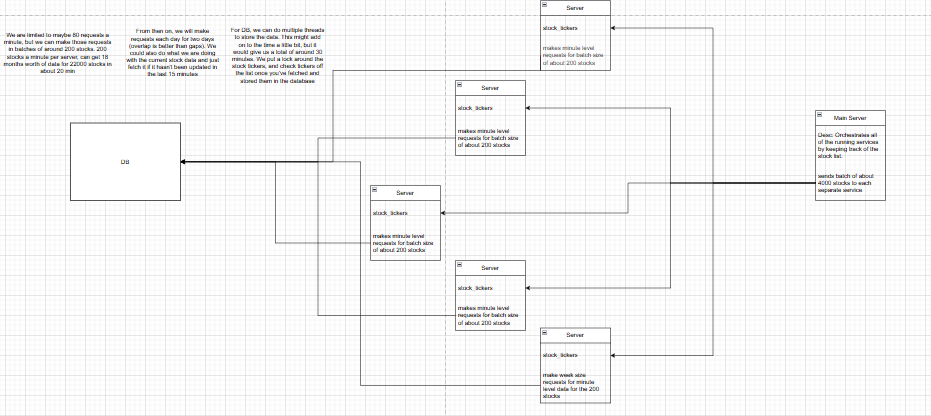
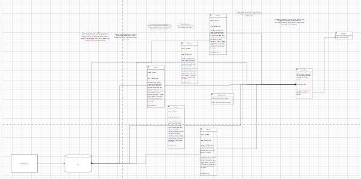
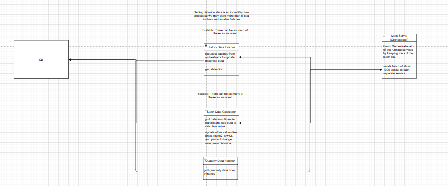

# Stock Data Fetchers and Calculators
## Architecture Diagrams
### Design v1

Can be found in designs/Stock History Data Fetching.drawio

### Design v2

Can be found in designs/Stock Data Fetch Design v2.drawio.png

### Design v3

Can be found in designs/Stock History Data Fetching.drawio

## File Structure Organization
- data_fetching_service/: The historical data fetching service lives in this folder. It contains all of the logic and testing for it. This would fetch 2 years of data for each stock that was available. If there was already data for a stock, it would update the data and fill in any gaps from 2 years ago to now. 
- stock_data_calculator/: Contains logic and tests for the stock data calculating services. This used data from our database to perform ratio calculations such as P/E and PEG.
- quarterly_data_fetcher/: Contains logic and tests for quarterly data fetching. This is the only module that used yfinance for data. Everything else uses the Polygon api. 
- historical_data_demo/: This was at first a demo for stock price predictions, but this eventually became the actual model that was used in our app.