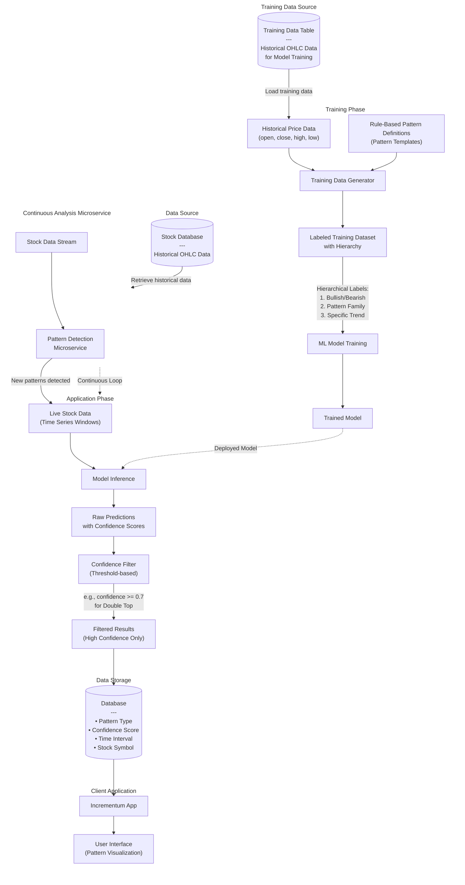

# Trend Analysis Microservice

## Architecture Diagram

## Pattern Hierarchy

The model is trained to recognize patterns in a hierarchical structure:

1. **Level 1: Market Direction**
   - Bullish (upward trend)
   - Bearish (downward trend)

2. **Level 2: Pattern Family**
   - Reversal patterns
   - Continuation patterns
   - Consolidation patterns

3. **Level 3: Specific Patterns**
   - Double Top
   - Double Bottom
   - Head and Shoulders
   - Triangles
   - Flags and Pennants
   - etc.